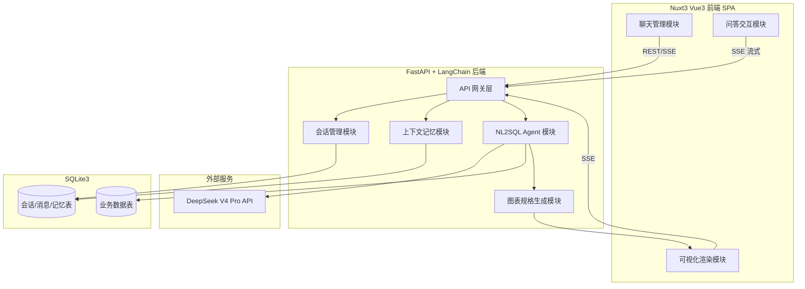
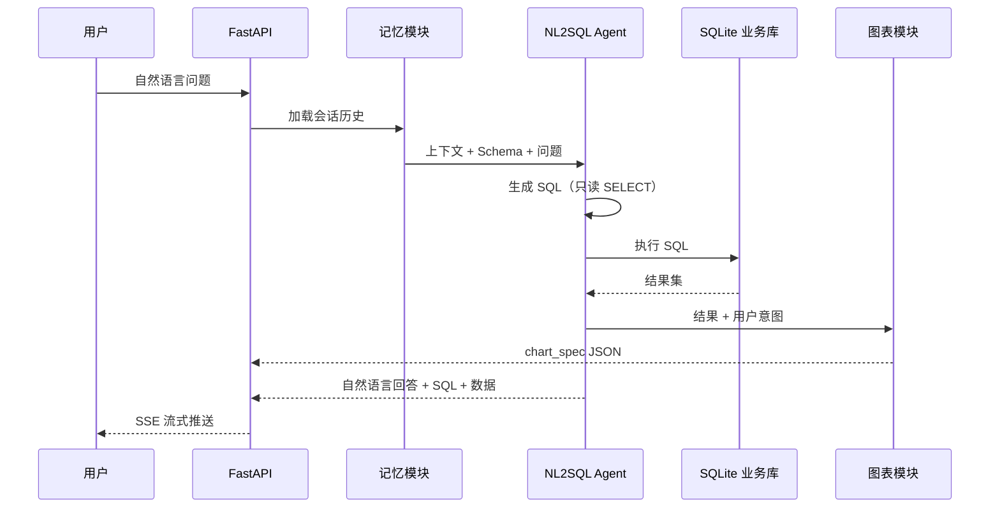
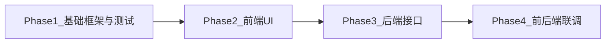

# 智能数据分析系统 Agent 计划文档

> **For Claude:** REQUIRED SUB-SKILL: Use superpowers:executing-plans to implement this plan task-by-task.

**Goal:** 构建一个基于 DeepSeek V4 Pro 的智能数据分析系统，支持自然语言查询 SQLite 数据库、多轮会话记忆，并在 **Vue 3 + Nuxt 3** 三栏布局中实时渲染可视化图表。

**Architecture:** 后端采用 FastAPI + LangChain 编排 NL2SQL Agent 与图表规格生成；SQLite3 同时承载业务数据与会话元数据；前端为 **Nuxt 3 SPA**（`ssr: false`），通过 REST + SSE 调用独立 FastAPI 后端，左侧管理会话、中间问答、右侧 ECharts 实时渲染。

**Tech Stack:** DeepSeek V4 Pro · LangChain · FastAPI · SQLite3 · **Vue 3 · Nuxt 3 · Pinia · vue-echarts** · SSE

**文档版本:** 2026-05-25  
**状态:** 待实现（Phase 1–4 均未开始，进度见 [§6.1](#61-phase-进度清单细粒度)）  
**已确认:** Phase 1 业务数据采用内置 Demo 数据集（`biz_orders`）；前端采用 **Vue 3**，**Nuxt 3 仅作工程化适配**（路由/构建/代理，不做 SSR 复杂化）

---

## 目录

1. [总体架构](#1-总体架构)
2. [后端模块规划](#2-后端模块规划)
3. [前端模块规划](#3-前端模块规划)
4. [LangChain 集成要点](#4-langchain-集成要点)
5. [SQLite 双用途设计](#5-sqlite-双用途设计)
6. [开发阶段与顺序](#6-开发阶段与顺序四-phase)
   - [6.1 Phase 进度清单（细粒度）](#61-phase-进度清单细粒度)
   - [6.2 进度更新规范](#62-进度更新规范)
7. [技术选型汇总](#7-技术选型汇总)
8. [Agent 执行任务清单](#8-agent-执行任务清单)

---

## 1. 总体架构



**核心数据流：** 用户提问 → 会话上下文组装 → LangChain Agent 生成 SQL → 执行 SQLite → 结果 + 图表规格 → 流式返回前端 → 右侧实时渲染图表。

---

## 2. 后端模块规划

### 2.1 项目目录结构

```
backend/
├── app/
│   ├── main.py                 # FastAPI 入口
│   ├── config.py               # 环境变量、DeepSeek API Key
│   ├── api/
│   │   ├── sessions.py         # 会话 CRUD
│   │   ├── chat.py             # 问答（SSE 流式）
│   │   └── schema.py           # 数据库 Schema 元信息
│   ├── core/
│   │   ├── llm.py              # DeepSeek 模型封装
│   │   ├── memory.py           # 上下文记忆
│   │   └── session.py          # 会话状态管理
│   ├── agents/
│   │   ├── nl2sql_agent.py     # Text-to-SQL Agent
│   │   ├── chart_agent.py      # 图表类型与配置生成
│   │   └── prompts/            # Prompt 模板
│   ├── db/
│   │   ├── sqlite.py           # 连接池 / 执行器
│   │   ├── models.py           # SQLAlchemy ORM（元数据表）
│   │   └── migrations/         # 初始化脚本
│   ├── services/
│   │   ├── query_service.py    # 查询编排（Agent 调用链）
│   │   └── viz_service.py      # 可视化规格转换
│   └── schemas/                # Pydantic 请求/响应模型
├── data/
│   └── business.db             # 业务 SQLite 数据
└── requirements.txt
```

### 2.2 模块职责明细

| 模块 | 职责 | 关键技术 |
|------|------|----------|
| **API 网关层** | 路由、CORS、鉴权（可选）、SSE | FastAPI, `sse-starlette` |
| **LLM 接入层** | 封装 DeepSeek V4 Pro，统一 chat/completion 接口 | `langchain-openai`（OpenAI 兼容 API） |
| **会话管理** | 创建/删除/重命名会话，绑定用户（可选） | SQLite ORM + REST API |
| **上下文记忆** | 多轮对话历史、Token 窗口裁剪、摘要压缩 | `ConversationBufferWindowMemory` 或自定义 |
| **NL2SQL Agent** | Schema 注入 → SQL 生成 → 校验 → 执行 → 自然语言总结 | LangChain Agent + SQLDatabase Toolkit |
| **图表规格生成** | 根据查询结果推断 chart type、轴字段、series | LLM 结构化输出（JSON Schema） |
| **查询编排服务** | 串联：记忆加载 → Agent → SQL 执行 → 图表规格 → 持久化消息 | LangChain LCEL Chain |
| **SQLite 双库策略** | 业务库 + 元数据库（同文件不同表，或分文件） | SQLAlchemy + `aiosqlite` |

### 2.3 会话与记忆设计

**SQLite 元数据表：**

```sql
CREATE TABLE sys_sessions (
    id          TEXT PRIMARY KEY,
    title       TEXT NOT NULL DEFAULT '新对话',
    created_at  DATETIME NOT NULL DEFAULT CURRENT_TIMESTAMP,
    updated_at  DATETIME NOT NULL DEFAULT CURRENT_TIMESTAMP
);

CREATE TABLE sys_messages (
    id                TEXT PRIMARY KEY,
    session_id        TEXT NOT NULL REFERENCES sys_sessions(id) ON DELETE CASCADE,
    role              TEXT NOT NULL,
    content           TEXT NOT NULL,
    sql_query         TEXT,
    query_result_json TEXT,
    chart_spec_json   TEXT,
    created_at        DATETIME NOT NULL DEFAULT CURRENT_TIMESTAMP
);

CREATE TABLE sys_session_summaries (
    session_id  TEXT PRIMARY KEY REFERENCES sys_sessions(id) ON DELETE CASCADE,
    summary     TEXT NOT NULL,
    updated_at  DATETIME NOT NULL DEFAULT CURRENT_TIMESTAMP
);
```

**记忆策略（分层）：**

1. **短期记忆**：最近 N 轮完整对话（建议 10 轮），存入 `sys_messages` 表
2. **工作记忆**：当前会话的 Schema 摘要、上次查询字段含义
3. **长期记忆（可选）**：超出窗口时用 LLM 压缩为 `sys_session_summaries`

### 2.4 NL2SQL Agent 流程



**安全约束（必做）：**

- 仅允许 `SELECT`，拦截 `DROP/INSERT/UPDATE/DELETE`
- SQL 超时与行数上限（建议 max 1000 行）
- Schema 白名单注入，禁止 LLM 臆造表名

### 2.5 核心 API 设计

| 方法 | 路径 | 说明 |
|------|------|------|
| GET | `/api/sessions` | 会话列表 |
| POST | `/api/sessions` | 新建会话 |
| PATCH | `/api/sessions/{id}` | 重命名会话 |
| DELETE | `/api/sessions/{id}` | 删除会话 |
| GET | `/api/sessions/{id}/messages` | 历史消息 |
| POST | `/api/chat/stream` | SSE 流式问答（body: session_id, message） |
| GET | `/api/schema` | 返回数据库表结构 |
| GET | `/api/health` | 健康检查 |

**SSE 事件类型：**

```json
{ "type": "token",  "content": "正在分析..." }
{ "type": "sql",    "content": "SELECT ..." }
{ "type": "data",   "content": [{}, {}] }
{ "type": "chart",  "content": { "type": "bar", "xField": "month", "yField": "sales", "data": [] } }
{ "type": "done",   "message_id": "xxx" }
{ "type": "error",  "content": "错误信息" }
```

---

## 3. 前端模块规划（Vue 3 + Nuxt 3）

> **Nuxt 定位：** 选用 **Nuxt 3** 作为 Vue 3 工程壳（目录约定、Vite 构建、布局/路由、开发代理）。本系统为前后端分离的 **SPA 仪表盘**，配置 `ssr: false`，**不依赖 Nuxt SSR 取数**；所有业务数据由浏览器直连 FastAPI（REST + SSE）。

### 3.1 项目目录结构

```
frontend/
├── nuxt.config.ts
├── app.vue
├── layouts/default.vue
├── pages/index.vue
├── components/session/SessionList.vue, SessionItem.vue
├── components/chat/ChatPanel.vue, MessageList.vue, ChatInput.vue
├── components/chart/ChartPanel.vue, ChartRenderer.vue
├── composables/useSessions.ts, useChatStream.ts, useChartSpec.ts
├── stores/app.ts
├── types/session.ts, message.ts, chart.ts
└── utils/api.ts, sse.ts
```

### 3.2 Nuxt 最小适配配置

| Nuxt 能力 | 本项目中用途 |
|-----------|--------------|
| `layouts/` + `pages/` | 三栏工作台路由与布局 |
| `composables/` | 会话、SSE 流、图表状态（自动导入） |
| `runtimeConfig.public.apiBase` | FastAPI 基地址 |
| `nitro.devProxy` | 开发环境 `/api` → `localhost:8000` |
| `@pinia/nuxt` | 全局状态 |
| **不使用** | SSR 预取、Nitro 替代 FastAPI |

```typescript
export default defineNuxtConfig({
  ssr: false,
  modules: ['@pinia/nuxt'],
  runtimeConfig: { public: { apiBase: 'http://localhost:8000' } },
  nitro: { devProxy: { '/api': { target: 'http://localhost:8000', changeOrigin: true } } }
})
```

### 3.3 三栏布局

```
┌─────────────┬──────────────────────────┬─────────────────┐
│  聊天管理    │       问答区域            │   可视化图表     │
│  (~240px)   │       (flex-1)           │   (~400px)      │
├─────────────┼──────────────────────────┼─────────────────┤
│ + 新建会话   │  [消息气泡列表]           │  [ECharts 图表]  │
│ 会话1       │                          │                 │
│ 会话2       │  ─────────────────────   │  图表类型切换    │
│ ...         │  [输入框 + 发送]          │  数据表格预览    │
└─────────────┴──────────────────────────┴─────────────────┘
```

| 区域 | 模块 | 功能 |
|------|------|------|
| **左侧** | SessionList | 会话 CRUD、高亮当前会话、自动标题（首问生成） |
| **中间** | ChatPanel | 消息渲染、Markdown、SQL 代码块展示、流式打字效果 |
| **中间** | ChatInput | 发送问题、禁用态（生成中）、快捷键 Enter |
| **右侧** | ChartPanel | 接收 `chart` SSE 事件，实时更新 ECharts |
| **右侧** | DataPreview | 原始查询结果表格（可选） |

### 3.4 全局状态（Pinia）

```typescript
// stores/app.ts
interface AppState {
  sessions: Session[];
  currentSessionId: string | null;
  messages: Record<string, Message[]>;
  chartSpec: ChartSpec | null;
  queryData: Record<string, unknown>[] | null;
  isStreaming: boolean;
}
```

### 3.5 图表规格统一格式

```typescript
interface ChartSpec {
  type: 'bar' | 'line' | 'pie' | 'scatter' | 'table';
  title?: string;
  xField?: string;
  yField?: string | string[];
  seriesField?: string;
  data: Record<string, unknown>[];
}
```

**渲染方案：** Apache ECharts + **vue-echarts**；UI 组件库推荐 **Element Plus** 或 Naive UI。

---

## 4. LangChain 集成要点

### 4.1 DeepSeek V4 Pro 接入

```python
from langchain_openai import ChatOpenAI

llm = ChatOpenAI(
    model="deepseek-v4-pro",
    api_key=settings.DEEPSEEK_API_KEY,
    base_url="https://api.deepseek.com/v1",
    streaming=True,
)
```

### 4.2 Agent 工具链

| 工具 | 作用 |
|------|------|
| `sql_db_schema` | 获取表结构 |
| `sql_db_query` | 执行只读 SQL |
| `sql_db_query_checker` | LLM 校验 SQL 合法性 |
| 自定义 `generate_chart_spec` | 结构化输出图表配置 |

### 4.3 Chain 结构

```
Input
  → [Load Memory]
  → [Schema Retriever]
  → [SQL Agent]
  → [Execute Query]
  → [Answer Generator]
  → [Chart Spec Generator]
  → [Save Message]
  → Stream Output
```

---

## 5. SQLite 双用途设计

| 用途 | 内容 | 说明 |
|------|------|------|
| **业务数据** | 销售、用户、订单等分析表 | 用户 NL 查询的目标 |
| **系统元数据** | sys_sessions, sys_messages, sys_session_summaries | 会话与记忆持久化 |

**建议：** 同一 SQLite 文件、不同表前缀（`sys_` / `biz_`），或 `business.db` + `system.db` 两个文件。

**内置 Demo 数据集（Phase 1 默认）：**

```sql
CREATE TABLE biz_orders (
    id         INTEGER PRIMARY KEY,
    product    TEXT NOT NULL,
    category   TEXT NOT NULL,
    amount     REAL NOT NULL,
    quantity   INTEGER NOT NULL,
    order_date TEXT NOT NULL,
    region     TEXT NOT NULL
);
```

---

## 6. 开发阶段与顺序（四 Phase）

按 **先框架 → 前端 UI → 后端接口 → 联调** 拆分，降低并行依赖风险。



> **进度追踪：** 细粒度任务见 [§6.1](#61-phase-进度清单细粒度)。每完成一个 Phase，Agent 必须按 [§6.2](#62-进度更新规范) 检查并更新本文档（已完成项用 ~~删除线~~ 标记）。

### Phase 概览

| Phase | 目标 | 交付物 |
|-------|------|--------|
| **Phase 1** | 前后端基础框架与运行验证 | backend + frontend 可独立启动，health 测试通过 |
| **Phase 2** | 前端 UI（Mock 数据） | 完整三栏 UI，不依赖真实后端可演示 |
| **Phase 3** | 后端接口研发 | 全部 REST/SSE 接口可用 |
| **Phase 4** | 前后端联调 | 可演示的完整智能数据分析系统 |

### 与 Agent Task 清单对应关系

| Phase | Tasks |
|-------|-------|
| Phase 1 | Task 1 + Task 9 前半 |
| Phase 2 | Task 9 后半 + Task 10–12 |
| Phase 3 | Task 2–8 |
| Phase 4 | Task 13（含 SSE/API 联调） |

---

### 6.1 Phase 进度清单（细粒度）

格式：`[PhaseN] 模块名: 说明`。完成后在该行使用 ~~删除线~~ 包裹整行，并在行末标注 `✅`。

**图例：** 未完成 = 普通列表项 · 已完成 = ~~整行删除线~~ ✅

#### Phase 1 — 前后端基础框架与运行验证

- [Phase1] **后端脚手架**：FastAPI 入口、`config.py` 环境变量、CORS 中间件
- [Phase1] **健康检查接口**：`GET /api/health` + pytest 冒烟测试
- [Phase1] **后端环境模板**：`.env.example`（`DEEPSEEK_API_KEY`、`SQLITE_PATH` 等）
- [Phase1] **Nuxt3 脚手架**：`nuxi init`、TypeScript、`ssr: false`
- [Phase1] **前端依赖安装**：Pinia、Element Plus、echarts、vue-echarts
- [Phase1] **Nuxt 开发代理**：`nitro.devProxy` 转发 `/api`、`runtimeConfig.public.apiBase`
- [Phase1] **联调探针页**：首页 fetch `/api/health`，页面显示后端连通状态

**Phase 1 验收：** `uvicorn` 与 `npm run dev` 均可启动；浏览器可见 health OK。

---

#### Phase 2 — 前端 UI 研发（Mock 数据）

- [Phase2] **三栏布局**：`layouts/default.vue`，左 240px / 中 flex-1 / 右 400px
- [Phase2] **SessionList**：会话列表、新建、删除、切换、重命名（本地 Mock）
- [Phase2] **SessionItem**：单条会话高亮、时间/标题展示
- [Phase2] **ChatPanel 容器**：中间问答区整体布局与滚动
- [Phase2] **MessageList**：用户/助手消息气泡、Markdown 渲染
- [Phase2] **MessageList SQL 块**：助手消息内 SQL 代码高亮展示
- [Phase2] **ChatInput**：输入框、发送按钮、Enter 快捷键、生成中禁用态
- [Phase2] **Mock 流式动画**：定时器模拟 token 逐字输出（Phase 4 前占位）
- [Phase2] **ChartPanel**：vue-echarts 图表容器、空态占位
- [Phase2] **ChartRenderer**：bar / line / pie / table 类型映射与静态样例渲染
- [Phase2] **数据表格预览**：右侧原始数据 Tab 或表格 fallback
- [Phase2] **图表类型切换**：bar ↔ line ↔ table 等 UI 切换（Mock 数据）
- [Phase2] **Pinia 状态管理**：`sessions`、`messages`、`chartSpec`、`queryData`、`isStreaming`
- [Phase2] **类型定义**：`types/session.ts`、`message.ts`、`chart.ts`

**Phase 2 验收：** 三栏 UI 完整可操作；切换会话/发送 Mock 消息/切换图表均正常。

---

#### Phase 3 — 后端接口研发

- [Phase3] **SQLite 连接管理**：`sqlite.py` 连接池、只读查询执行器（行数/超时限制）
- [Phase3] **Schema 迁移**：`001_init.sql`（`sys_*` + `biz_orders` 表）
- [Phase3] **Demo 示例数据**：`002_demo_data.sql`（50+ 条订单种子数据）
- [Phase3] **ORM 模型**：`models.py` SQLAlchemy 定义
- [Phase3] **LLM 接入**：DeepSeek V4 Pro 配置、`core/llm.py` streaming 封装
- [Phase3] **会话管理 API**：`GET/POST/PATCH/DELETE /api/sessions`
- [Phase3] **消息历史 API**：`GET /api/sessions/{id}/messages`
- [Phase3] **Schema 元信息 API**：`GET /api/schema`
- [Phase3] **上下文记忆**：`load/save/build_chat_history`，最近 N 轮窗口
- [Phase3] **NL2SQL Prompt**：Schema 注入、SQLite 方言、只读约束
- [Phase3] **LangChain SQL Agent**：工具定义、Agent 创建、SQL 安全校验
- [Phase3] **图表规格 Agent**：`chart_agent.py` 输出 ChartSpec JSON
- [Phase3] **可视化服务**：`viz_service.py` 字段校验与 table fallback
- [Phase3] **查询编排服务**：`query_service.py` 串联记忆→Agent→保存
- [Phase3] **SSE 聊天接口**：`POST /api/chat/stream`
- [Phase3] **SSE 事件格式**：`token` / `sql` / `data` / `chart` / `done` / `error`
- [Phase3] **接口测试**：pytest 覆盖 sessions、memory、nl2sql、chat stream

**Phase 3 验收：** Postman/curl/pytest 可独立验证全部后端接口。

---

#### Phase 4 — 前后端联调

- [Phase4] **前端 API 服务层**：`utils/api.ts` 封装 sessions/messages/schema 调用
- [Phase4] **SSE 客户端**：`utils/sse.ts` 解析流式事件
- [Phase4] **会话联调**：`useSessions.ts` 替换 Mock，对接 REST CRUD
- [Phase4] **聊天联调**：`useChatStream.ts` 对接 SSE，实时渲染 token 文本
- [Phase4] **SQL/数据展示**：SSE `sql`/`data` 事件更新 MessageList
- [Phase4] **图表数据绑定**：SSE `chart` 事件 → Pinia → ChartRenderer 动态渲染
- [Phase4] **流式状态同步**：`isStreaming` 控制输入禁用与 loading 态
- [Phase4] **会话标题自动更新**：首条用户消息后 PATCH session title
- [Phase4] **端到端场景 1**：新建会话 →「各品类销售总额」→ 柱状图
- [Phase4] **端到端场景 2**：多轮追问「只要华东地区的」→ 上下文继承
- [Phase4] **错误处理联调**：SSE `error` 事件前端 toast/提示
- [Phase4] **项目文档**：`README.md` 启动说明、`.env.example` 补全

**Phase 4 验收：** 浏览器完整走通 NL 查库 + 图表 + 多轮对话。

---

### 6.2 进度更新规范

**触发时机：** 每完成一个 **Phase**（该 Phase 下所有细粒度项均验收通过）时，Agent **必须**执行文档检查并更新 [§6.1](#61-phase-进度清单细粒度)。

**更新步骤：**

1. **核对验收项** — 对照 Phase 末尾的「验收」条件，确认全部满足
2. **划线已完成项** — 将该 Phase 下每一条 `- [PhaseN] ...` 用 Markdown 删除线包裹：

   ```markdown
   - ~~[Phase1] **后端脚手架**：FastAPI 入口、`config.py` 环境变量、CORS 中间件~~ ✅
   ```

3. **更新文档头部状态** — 修改文首 `**状态:**` 字段，例如：`Phase 1 已完成，进行中：Phase 2`
4. **可选：同步 Linear** — 在「智能数据分析助理」项目中勾选/关闭对应 Issue
5. **禁止** — 未完成验收前提前划线；禁止删除历史条目（只划线，不删行）

**Agent 执行指令（写入 executing-plans 检查点）：**

> 完成 Phase N 后，REQUIRED：打开 `docs/plans/2026-05-24-intelligent-data-analysis-system.md`，更新 §6.1 Phase N 全部条目为 ~~删除线~~ ✅，并更新文首状态行，再开始 Phase N+1。

**当前进度（最后更新：2026-05-25）：**

| Phase | 状态 |
|-------|------|
| Phase 1 | ⬜ 未开始 |
| Phase 2 | ⬜ 未开始 |
| Phase 3 | ⬜ 未开始 |
| Phase 4 | ⬜ 未开始 |

---

## 7. 技术选型汇总

| 层级 | 选型 |
|------|------|
| 大模型 | DeepSeek V4 Pro |
| 后端框架 | FastAPI |
| AI 编排 | LangChain (LCEL + SQL Agent) |
| 数据库 | SQLite3（业务 + 元数据） |
| 前端框架 | **Vue 3 + Nuxt 3**（SPA，`ssr: false`） |
| 状态管理 | **Pinia** |
| UI 组件 | Element Plus / Naive UI |
| 图表 | ECharts + **vue-echarts** |
| 通信 | REST + SSE（流式） |
| 包管理 | backend: pip/uv；frontend: pnpm |
| Node | **18+ / 20+**（Nuxt 3 要求） |

---

## 8. Agent 执行任务清单

以下任务按顺序执行；每完成一个任务提交一次（`feat:` / `fix:` 前缀）。

> **Phase 完成检查点：** 当一个 Phase 的全部细粒度项（[§6.1](#61-phase-进度清单细粒度)）验收通过后，必须按 [§6.2](#62-进度更新规范) 更新文档（~~删除线~~ + ✅），再进入下一 Phase。

### Task 1: 后端脚手架

**Files:**
- Create: `backend/requirements.txt`
- Create: `backend/app/config.py`
- Create: `backend/app/main.py`
- Create: `backend/.env.example`

**Step 1:** 创建 `requirements.txt`，包含 fastapi、uvicorn、langchain、langchain-openai、langchain-community、sqlalchemy、aiosqlite、pydantic、python-dotenv、sse-starlette。

**Step 2:** 实现 `config.py`，读取 `DEEPSEEK_API_KEY`、`SQLITE_PATH`、`MAX_QUERY_ROWS`、`SQL_TIMEOUT_SECONDS`。

**Step 3:** 实现 `main.py`，注册 CORS，暴露 `GET /api/health`。

**Step 4:** 验证启动：

```bash
cd backend && uvicorn app.main:app --reload
curl http://localhost:8000/api/health
```

**Step 5:** Commit — `feat: scaffold FastAPI backend`

---

### Task 2: SQLite 初始化与 Demo 数据

**Files:**
- Create: `backend/app/db/sqlite.py`
- Create: `backend/app/db/models.py`
- Create: `backend/app/db/migrations/001_init.sql`
- Create: `backend/app/db/migrations/002_demo_data.sql`

**Step 1:** 编写 `001_init.sql`，创建 `sys_sessions`、`sys_messages`、`sys_session_summaries`、`biz_orders` 表。

**Step 2:** 编写 `002_demo_data.sql`，插入 50+ 条示例订单数据（多品类、多地区、多月份）。

**Step 3:** 实现 `sqlite.py` 连接管理与只读查询执行器（含行数限制与超时）。

**Step 4:** 实现 `models.py` SQLAlchemy ORM 模型。

**Step 5:** 应用启动时自动执行 migration 脚本。

**Step 6:** Commit — `feat: add SQLite schema and demo data`

---

### Task 3: DeepSeek LLM 接入

**Files:**
- Create: `backend/app/core/llm.py`
- Create: `backend/tests/test_llm.py`

**Step 1:** 封装 `get_llm()` 返回 streaming ChatOpenAI 实例。

**Step 2:** 编写测试验证 LLM 可响应（需配置 `DEEPSEEK_API_KEY`）。

**Step 3:** Commit — `feat: integrate DeepSeek V4 Pro via LangChain`

---

### Task 4: 会话管理 API

**Files:**
- Create: `backend/app/schemas/session.py`
- Create: `backend/app/core/session.py`
- Create: `backend/app/api/sessions.py`
- Create: `backend/tests/test_sessions.py`

**Step 1:** 实现 Pydantic 模型：`SessionCreate`、`SessionUpdate`、`SessionResponse`、`MessageResponse`。

**Step 2:** 实现 CRUD：列表、创建、重命名、删除、获取消息历史。

**Step 3:** 在 `main.py` 注册 sessions 路由。

**Step 4:** 编写 API 测试。

**Step 5:** Commit — `feat: add session management API`

---

### Task 5: 上下文记忆模块

**Files:**
- Create: `backend/app/core/memory.py`
- Create: `backend/tests/test_memory.py`

**Step 1:** 实现 `load_session_messages(session_id, limit=10)` 从 DB 加载历史。

**Step 2:** 实现 `save_message(session_id, role, content, sql, result, chart_spec)` 持久化消息。

**Step 3:** 实现 `build_chat_history(messages)` 转为 LangChain Message 列表。

**Step 4:** 可选：实现超出窗口时的摘要压缩逻辑。

**Step 5:** Commit — `feat: add conversation memory module`

---

### Task 6: NL2SQL Agent

**Files:**
- Create: `backend/app/agents/prompts/nl2sql.txt`
- Create: `backend/app/agents/nl2sql_agent.py`
- Create: `backend/tests/test_nl2sql_agent.py`

**Step 1:** 编写 NL2SQL Prompt，注入 Schema、只读约束、SQLite 方言说明。

**Step 2:** 使用 LangChain SQLDatabase Toolkit 构建 Agent。

**Step 3:** 实现 SQL 安全校验：仅允许 SELECT，拒绝危险关键字。

**Step 4:** 编写集成测试：「各品类销售总额」类问题能返回正确 SQL 与结果。

**Step 5:** Commit — `feat: add NL2SQL agent with read-only guard`

---

### Task 7: 图表规格生成

**Files:**
- Create: `backend/app/agents/prompts/chart.txt`
- Create: `backend/app/agents/chart_agent.py`
- Create: `backend/app/services/viz_service.py`
- Create: `backend/tests/test_chart_agent.py`

**Step 1:** 定义 `ChartSpec` Pydantic 模型（type, xField, yField, data 等）。

**Step 2:** 实现 chart_agent，根据查询结果和用户问题生成 ChartSpec JSON。

**Step 3:** 实现 viz_service 做字段校验与 fallback（无法图表化时返回 table 类型）。

**Step 4:** Commit — `feat: add chart spec generation agent`

---

### Task 8: 查询编排与 SSE 流式 API

**Files:**
- Create: `backend/app/services/query_service.py`
- Create: `backend/app/api/chat.py`
- Create: `backend/app/schemas/chat.py`
- Create: `backend/tests/test_chat_stream.py`

**Step 1:** 实现 `query_service.run(session_id, user_message)` 编排完整链路：加载记忆 → NL2SQL → 执行 → 生成回答 → 生成图表 → 保存消息。

**Step 2:** 实现 `POST /api/chat/stream`，按 token/sql/data/chart/done/error 事件类型 SSE 推送。

**Step 3:** 首条用户消息时自动更新会话标题。

**Step 4:** Commit — `feat: add streaming chat API with query orchestration`

---

### Task 9: Nuxt 3 前端脚手架（Phase 1）

**Files:**
- Create: `frontend/`（`nuxi init` Nuxt 3 + TypeScript）
- Create: `frontend/nuxt.config.ts`
- Create: `frontend/layouts/default.vue`
- Create: `frontend/pages/index.vue`

**Step 1:** 初始化 Nuxt 3，安装 `@pinia/nuxt`、`element-plus`、`echarts`、`vue-echarts`。

**Step 2:** 配置 `ssr: false`、`runtimeConfig.public.apiBase`、`nitro.devProxy`。

**Step 3:** 实现三栏布局骨架与健康检查探针（fetch `/api/health`）。

**Step 4:** `npm run dev` 验证页面可访问、代理可达后端。

**Step 5:** Commit — `feat: scaffold Nuxt3 Vue3 frontend`

---

### Task 10: 前端会话管理 UI（Phase 2，Mock）

**Files:**
- Create: `frontend/types/session.ts`
- Create: `frontend/utils/api.ts`
- Create: `frontend/composables/useSessions.ts`
- Create: `frontend/components/session/SessionList.vue`
- Create: `frontend/components/session/SessionItem.vue`

**Step 1:** 先用本地 Mock 数据实现会话列表、新建、删除、切换、重命名。

**Step 2:** 预留 `api.ts` 接口函数签名，Phase 4 再对接真实 API。

**Step 3:** Commit — `feat: add session management UI with mock data`

---

### Task 11: 前端聊天 UI（Phase 2，Mock 流式）

**Files:**
- Create: `frontend/types/message.ts`
- Create: `frontend/utils/sse.ts`（Phase 2 用 Mock 定时器模拟 token）
- Create: `frontend/composables/useChatStream.ts`
- Create: `frontend/components/chat/ChatPanel.vue`
- Create: `frontend/components/chat/MessageList.vue`
- Create: `frontend/components/chat/ChatInput.vue`
- Create: `frontend/stores/app.ts`

**Step 1:** Pinia store 管理 messages、isStreaming。

**Step 2:** Mock 流式打字与 SQL 代码块展示。

**Step 3:** Commit — `feat: add chat panel UI with mock streaming`

---

### Task 12: 前端图表 UI（Phase 2，静态 ChartSpec）

**Files:**
- Create: `frontend/types/chart.ts`
- Create: `frontend/composables/useChartSpec.ts`
- Create: `frontend/components/chart/ChartRenderer.vue`
- Create: `frontend/components/chart/ChartPanel.vue`

**Step 1:** vue-echarts 根据静态 ChartSpec 渲染 bar/line/pie/table。

**Step 2:** 无数据占位态。

**Step 3:** Commit — `feat: add chart panel with vue-echarts`

---

### Task 13: 前后端联调与文档（Phase 4）

**Files:**
- Modify: `frontend/utils/sse.ts`, `frontend/composables/useChatStream.ts`, `frontend/composables/useSessions.ts`
- Create: `README.md`
- Modify: `backend/.env.example`

**Step 1:** SSE 对接 `POST /api/chat/stream`，sessions/messages 对接 REST API，替换全部 Mock。

**Step 2:** 端到端验证：新建会话 → 提问「各品类销售总额」→ 图表更新。

**Step 3:** 验证多轮对话：「只要华东地区的」→ 上下文继承。

**Step 4:** 编写 README：Node 18+、pnpm、环境变量、启动命令。

**Step 5:** Commit — `docs: e2e integration and setup guide`

---

## 执行方式

计划已保存至 `docs/plans/2026-05-24-intelligent-data-analysis-system.md`。

**两种执行方式：**

1. **Subagent-Driven（当前会话）** — 按 Task 逐个派发子 Agent 执行，每步之间 review，迭代较快
2. **Parallel Session（新会话）** — 在新会话中使用 executing-plans skill，批量执行并设置检查点

请告知希望采用哪种方式，或指定从哪个 Task 开始实现。
